# 光线追踪的简单实现

本仓库内容是 [Ray Tracing in One Weekend](https://raytracing.github.io/books/RayTracingInOneWeekend.html) 的学习实践记录

## "光栅化(Rasterization)"和"光线追踪"

**渲染图像的方式差异**

光栅化和光线追踪是两种主要的 3d 图像渲染方式

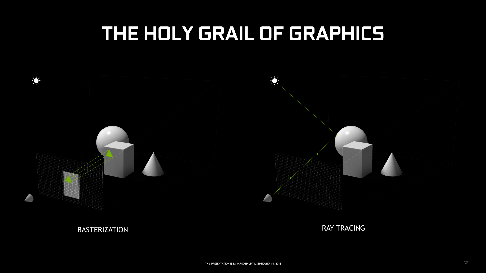

光栅化的渲染思路: 将 3d 几何体投影到 2d 平面(屏幕), 再离散为一个个像素

光线追踪的渲染思路: 从 2d 平面(屏幕)的每个像素往 3d 空间发射"光线", 遇到 3d 物体后记录碰撞表面的颜色, 作为像素的颜色

**性能**

光栅化非常"迅速", 广泛用于各种实时的 3d 游戏

光线追踪非常消耗性能, 一般都只在离线渲染(非实时)的场景使用, 比如 3d 电影, 可以一张图渲染几小时

**图像的视觉观感**

随着硬件和技术的进步, 近些年出现了一些实时光线追踪的游戏

Minecraft 原版

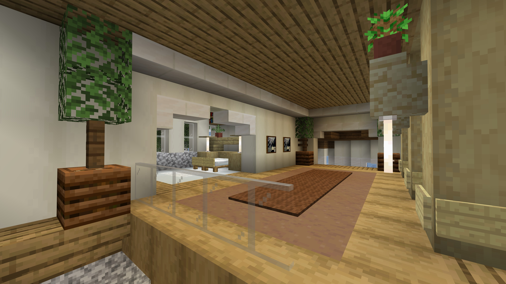

开启光线追踪后

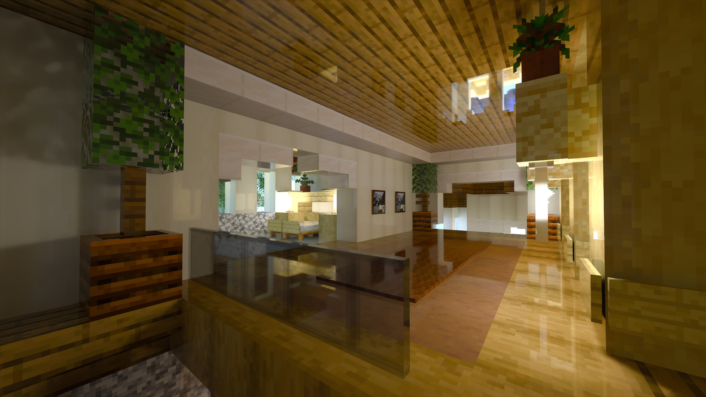

光线追踪由于模拟真实的物理光线成像方式, 效果往往更好

## 实现简单的光追渲染

### 实现效果

这里先放一个最终的实现效果

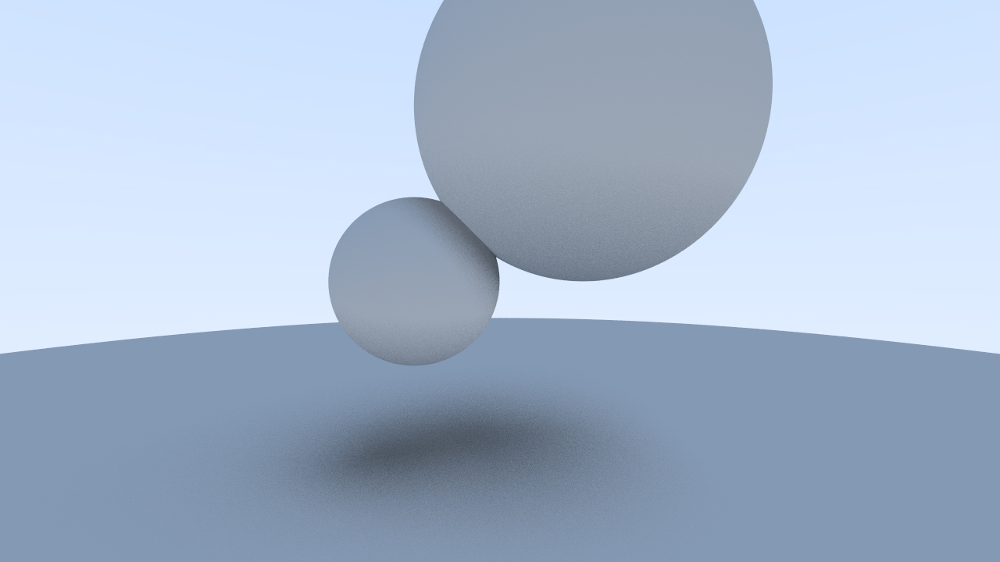

### 坐标系

讨论的内容都是在 3d 空间之中的, 为了方便描述各个物体的位置, 引入了坐标系这个工具

有两种常见的坐标系, "左手"和"右手"坐标系

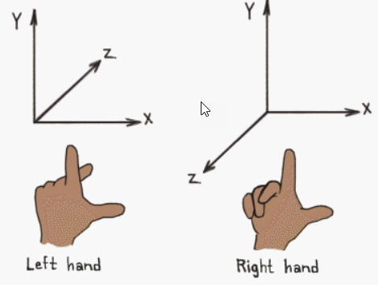

通常 3d 建模软件里使用右手坐标系

这里有个方便记忆的顺序映射关系

```
大拇指, 食指, 中指

r, g, b

x, y, z
```

### 3d 图像的产生

摄像机可以理解为空间中的一个点, 是光线穿过屏幕汇聚的点

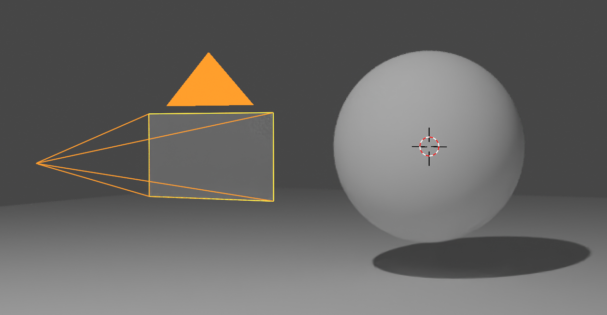

屏幕由一个个像素点构成

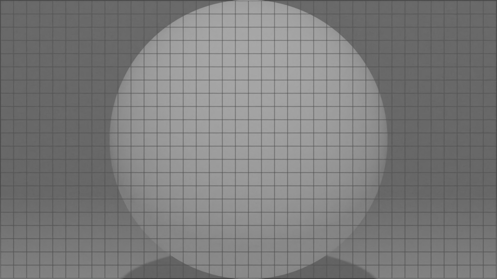

### 发射光线

从摄像机的位置向屏幕上每个像素点发射光线

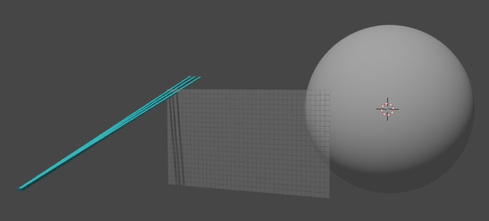

### 碰撞到物体

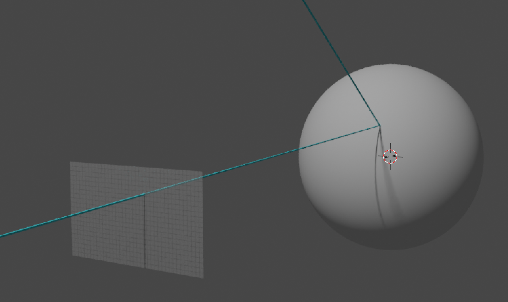

碰撞到物体后, 粗糙的物体表面会吸收光线, 这里假设有 50%的光线被吸收

之后剩余没有被吸收的光线会反弹

如果物体表面光滑, 入射角出射角相同, 发生镜面反射


如果物体表面粗糙, 会发生漫反射


### 像素点呈现的颜色

假设光经过物体碰撞后不改变颜色, 只是部分被吸收, 那么物体表面呈现的颜色就是光源的颜色

当发生多次碰撞后, 光线会"回到"光源, 此时结束了这条光线的生命, 而光源的颜色就是像素点的颜色

由于存在碰撞, 假设每次碰撞光亮度降低 0.5, 3 次碰撞后, 像素的颜色是 0.125 的光源的颜色

### 阴影的产生

阴影有两种产生的情况

1. 光线没有照射到物体表面, 物体表面被遮挡

2. 光线被彻底吸收了, 两个相邻的物体表面距离很近, 光线在其间不断反射最终消失

代码里的实现没有考虑第 1 种情况, 阴影的产生来自第 2 种

### 抗锯齿

上文中, 每个像素只有一条光线, 所以每个像素只会有单一的一个特定颜色, 渲染结果会很生硬

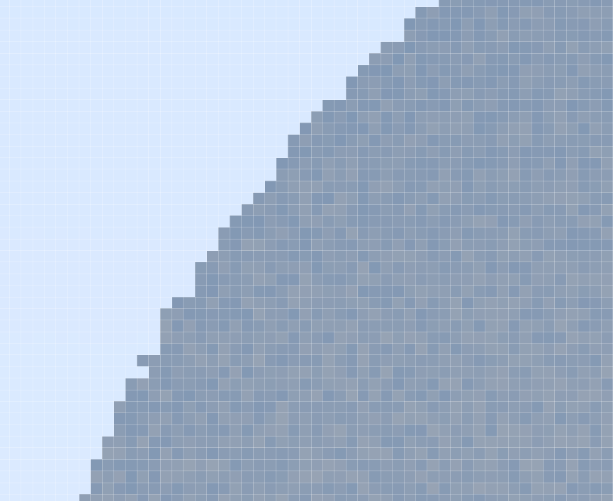

为了使得渲染结果变得平滑, 可以每个像素发射多条光线, 分布在像素里不同的位置, 最后取颜色叠加的平均值, 这样就起到了平滑的效果

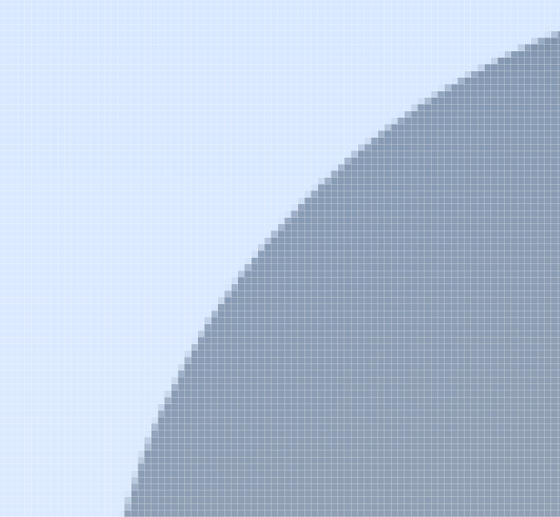

### 光线反弹的次数对画质的影响

光线反弹次数少的话, 可能在到达光源前就消失了, 导致像素点呈现黑色

视觉上来看就是"噪点很多"

同样的每个像素 20 条光线

这是反弹 3 次的效果, 可以看到有很强的"颗粒感"

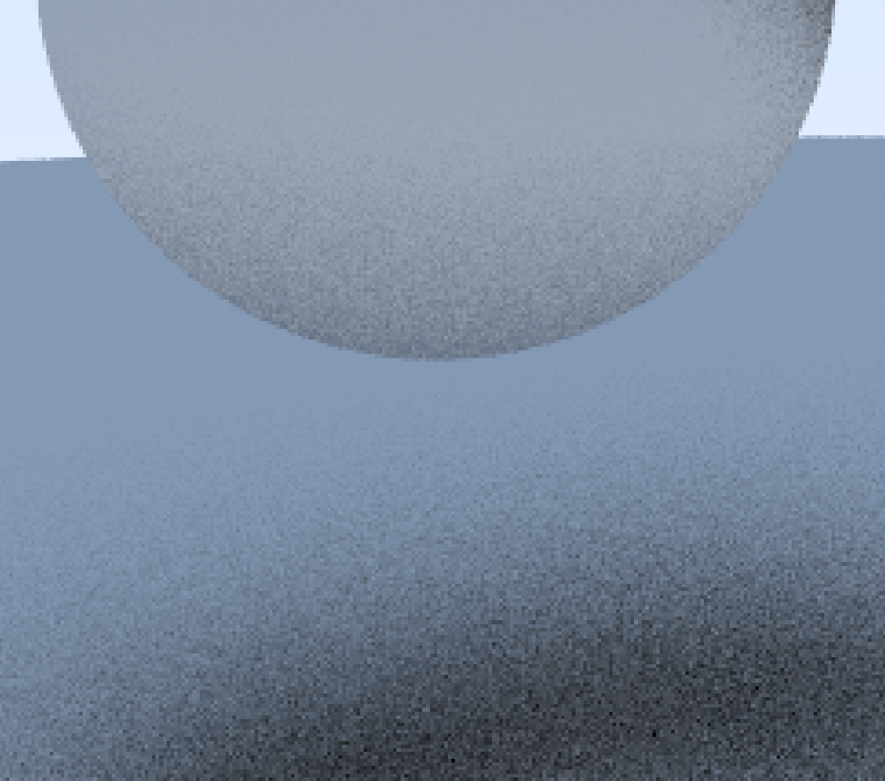

这是反弹 20 次的效果, 可以看到画面更加"平滑"


### 为什么光线追踪"很慢"

从光线追踪的原理可以知道, 每条光线会经过多次的反射, 每个像素需要多条光线来抗锯齿, 这个过程虽然简单, 但迭代的次数很多

以上面的例子来看, 输出图像尺寸为 `1280 * 720`, 每个像素 20 条光线, 光线反射 20 次

需要 `1280 * 720 * 20 * 20 = 3.6864 * 10 ^ 8` 次迭代

这只是最基本的渲染, 不考虑物体发光, 折射, 色散等场景

而应对更大的屏幕比如 1080p, 需要`8.2944 * 10 ^8`次

是 720p 的两倍以上
